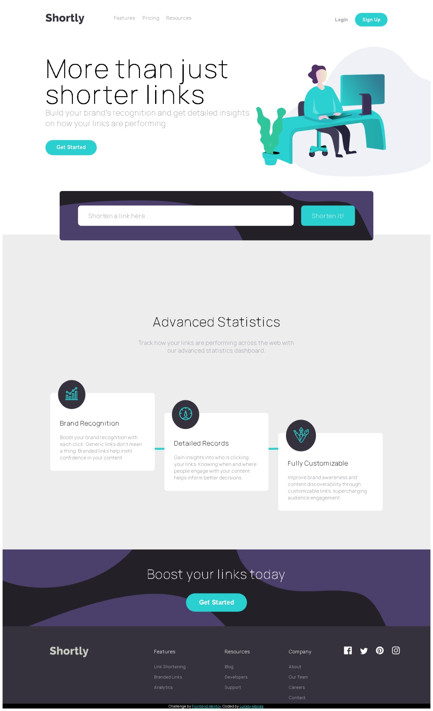

# Frontend Mentor - Shortly URL shortening API Challenge solution

This is a solution to the [Shortly URL shortening API Challenge challenge on Frontend Mentor](https://www.frontendmentor.io/challenges/url-shortening-api-landing-page-2ce3ob-G). Frontend Mentor challenges help you improve your coding skills by building realistic projects. 

## Table of contents

- [Overview](#overview)
  - [The challenge](#the-challenge)
  - [Screenshot](#screenshot)
  - [Links](#links)
- [My process](#my-process)
  - [Built with](#built-with)
  - [What I learned](#what-i-learned)
  - [Useful resources](#useful-resources)
- [Author](#author)


## Overview

### The challenge

Users should be able to:

- View the optimal layout for the site depending on their device's screen size
- Shorten any valid URL
- See a list of their shortened links, even after refreshing the browser
- Copy the shortened link to their clipboard in a single click
- Receive an error message when the `form` is submitted if:
  - The `input` field is empty

### Screenshot




### Links

- Solution URL: [repository](https://github.com/macluiggy/url-shortening-api-master-FM)
- Live Site URL: [GitHub Page](https://macluiggy.github.io/url-shortening-api-master-FM)

## My process

### Built with

- Semantic HTML5 markup
- CSS custom properties
- Flexbox
- CSS Grid
- CSS transitions
- Media queries
- Mobile-first workflow
- [Sass](https://sass-lang.com/) - CSS preprocessor


### What I learned

This was he first time I used an API Rest, the API is from the <a href="https://shrtco.de/">shrtcode website</a>. The format in which the data from the api is brought is JSON, I used the fetch promise to bring the json object, this is the code:
```js
        fetch(url)
            .then(jsonObject => jsonObject.json())
            .then(object => showLink(object))
            .catch(() => alert('Sorry, there was an error, please try again!'));
```

 Then I used the then method to put a function in it as a parameter which convert the JSON file in a JavaScript object, then the function showLink() is called, this will show the shortened link to the user, here is the code I used: used:

```js
let showLink = object => {
            p(object.result.short_link)
            let links = document.createElement('article');
            links.setAttribute('class', 'shortened_link')
            links.innerHTML = `<p class="original_link">${addUrl}</p><p><span class="link_to_copy">${object.result.short_link}</span><button class="copy_shortened_link">copy</button></p>`;
            $('.shorted_links_container').appendChild(links);

```
To copy the link to the clipboard I used the navigator API, when the links are added, a button is added to, do when a user click in it, it call an event and the API do its work, this is the code:

```js
copyUrls.forEach(copyUrl => {
                // statements
                copyUrl.addEventListener('click', () => {
                    var text = copyUrl.previousElementSibling.innerText;
                    navigator.clipboard.writeText(text).then(function() {
                        p('copied')
                        copyUrl.innerText = 'copied!';
                        copyUrl.style.backgroundColor = 'var(--very_dark_blue)';
                    }, function(err) {
                        alert('Async: Could not copy text: ');
                    });

                });
            });
```

I also used mixins to automatize the filters function, to prevent problems with different browsers, this is the code:

```scss
@mixin filter($function, $val) {
  @if $function == brightness {
    -webkit-filter: brightness($val);
    -moz-filter: brightness($val);
    filter: brightness($val);
  } @else if $function == grayscale {
    -webkit-filter: grayscale($val);
    -moz-filter: grayscale($val);
    filter: grayscale($val);
  } @else if $function == drop-shadow {
    -webkit-filter: drop-shadow($val);
    -moz-filter: drop-shadow($val);
    filter: drop-shadow($val);
  } @else if $function == opacity {
    -webkit-filter: opacity($val);
    -moz-filter: opacity($val);
    filter: opacity($val);
  } @else if $function == invert {
    -webkit-filter: invert($val);
    -moz-filter: invert($val);
    filter: invert($val);
  } @else if $function == contrast {
    -webkit-filter: contrast($val);
    -moz-filter: contrast($val);
    filter: contrast($val);
  } @else if $function == saturate {
    -webkit-filter: saturate($val);
    -moz-filter: saturate($val);
    filter: saturate($val);
  }
}
```

### Useful resources
[w3school](https://www.w3schools.com/) and [stackoverflow](https://stackoverflow.com/) were of great help to solve some doubts.

## Author

- Frontend Mentor - [@macluiggy](https://www.frontendmentor.io/profile/macluiggy)
- LinkedIn - [Luiggy Macias](https://www.linkedin.com/in/luiggy-macias-402696155/)
